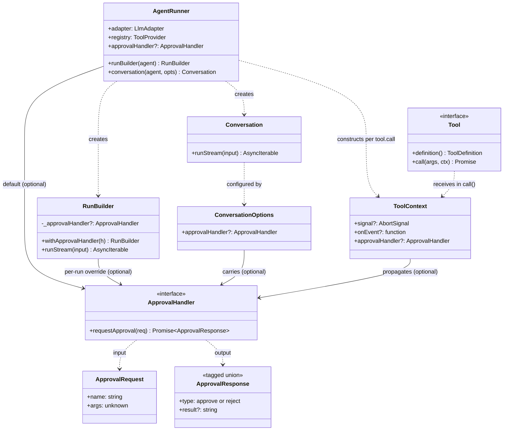

# Technical Specification: Sub-Agent Approval Architecture

## 1. Architectural Overview

### 1.1 Today (the broken topology)

```
┌──────────────────────────────────────────────────────────────────────┐
│                            @mast-ai/core                             │
│                                                                      │
│   ┌──────────────────┐    ┌────────────────┐                         │
│   │   AgentRunner    │───▶│  ToolProvider  │  ToolDefinition[]       │
│   │   (adapter,      │    │  (registry)    │  + getTool(name)        │
│   │    registry)     │    └────────────────┘                         │
│   └──────────────────┘                                               │
│                                                                      │
│   ┌──────────────────────────────────────┐                           │
│   │   createAgentTool(runner, agent, …)  │  captures `runner`        │
│   │   returns Tool whose call() runs      │  at factory time          │
│   │   `runner.runBuilder(agent)…`        │                           │
│   └──────────────────────────────────────┘                           │
└──────────────────────────────────────────────────────────────────────┘
                                  │
                                  ▼
┌──────────────────────────────────────────────────────────────────────┐
│                          @mast-ai/react-ui                           │
│                                                                      │
│   ┌────────────────────┐                                             │
│   │   AgentProvider    │   on mount:                                 │
│   │                    │     wrappedReg = withApprovalProxy(         │
│   │                    │                    runner.registry, …)     │
│   │                    │     wrappedRunner = new AgentRunner(        │
│   │                    │                       runner.adapter,       │
│   │                    │                       wrappedReg)           │
│   │                    │     conv = wrappedRunner.conversation(…)   │
│   └────────────────────┘                                             │
└──────────────────────────────────────────────────────────────────────┘
```

The wrap is _not visible_ to anything that captured `runner` before the
provider mounted. The sub-agent path calls `runner.runBuilder(...)` on the
unwrapped runner, so its tool resolution skips the approval proxy.

### 1.2 After (per-run policy through context)

```
┌──────────────────────────────────────────────────────────────────────┐
│                            @mast-ai/core                             │
│                                                                      │
│   ┌──────────────────┐                                               │
│   │   AgentRunner    │   gates `requiresApproval` tools by           │
│   │                  │   consulting the run's approvalHandler;       │
│   │                  │   propagates the handler into ToolContext     │
│   └──────────────────┘                                               │
│                                                                      │
│   ┌────────────────────────────────────────────────────────┐         │
│   │   RunBuilder.withApprovalHandler(handler)             │         │
│   │   Conversation accepts handler at construction        │         │
│   └────────────────────────────────────────────────────────┘         │
│                                                                      │
│   ┌────────────────────────────────────────────────────────┐         │
│   │   createAgentTool(runner, agent, options)             │         │
│   │   tool.call(args, ctx):                                │         │
│   │     builder = runner.runBuilder(agent).forwardTo(ctx) │         │
│   │     // inherit unless child runner has its own handler│         │
│   │     if (ctx.approvalHandler && !runner.approvalHandler)│        │
│   │       builder.withApprovalHandler(ctx.approvalHandler)│         │
│   └────────────────────────────────────────────────────────┘         │
└──────────────────────────────────────────────────────────────────────┘
                                  │
                                  ▼
┌──────────────────────────────────────────────────────────────────────┐
│                          @mast-ai/react-ui                           │
│                                                                      │
│   ┌────────────────────┐                                             │
│   │   AgentProvider    │   uses the user's runner directly           │
│   │                    │   (no shadow runner, no registry wrap)      │
│   │                    │   conv = runner.conversation(agent, {       │
│   │                    │            approvalHandler: uiHandler })    │
│   └────────────────────┘                                             │
└──────────────────────────────────────────────────────────────────────┘
```

### 1.3 Inheritance flow at run time

```
   User clicks "Send" in <ChatInput>
            │
            ▼
   conversation.runStream(input)
            │
            │   builder = runner.runBuilder(PARENT).history(…)
            │   builder.withApprovalHandler(uiHandler)        ← attached by
            │                                                   AgentProvider
            ▼
   AgentRunner.executeStream  (PARENT)
            │
            │  for each tool call:
            │    if (def.requiresApproval && handler)
            │       decision = await handler({name, args})
            │       …gate execution…
            │    else
            │       tool.call(args, {
            │         signal, onEvent,
            │         approvalHandler: handler              ← propagated
            │       })
            ▼
   delegate.call(args, ctx)         (a createAgentTool tool)
            │
            │  childBuilder = childRunner.runBuilder(CHILD).forwardTo(ctx)
            │  if (ctx.approvalHandler && !childRunner.approvalHandler)
            │     childBuilder.withApprovalHandler(ctx.approvalHandler)
            ▼
   AgentRunner.executeStream  (CHILD)
            │
            │  same handler is consulted for CHILD's tool calls,
            │  even though CHILD runs on a completely different
            │  AgentRunner instance.
            ▼
   sensitive.call → gated by uiHandler → user sees inline approval card
```

Two important properties of this flow:

1. **`childRunner` can be entirely independent.** It can have a different
   adapter, a different registry, and a different toolset. Inheritance is
   through `ctx.approvalHandler`, a value, not through a runner reference.
2. **An explicit handler on the child wins.** `createAgentTool` only
   inherits when the child runner does not already have one configured.

## 2. Type Changes

### 2.0 Type relationships at a glance



Reading the diagram:

- **`ApprovalHandler` is a single-interface concept** consumed in three places:
  attached to a runner as a default, attached to a single run via
  `RunBuilder.withApprovalHandler`, or threaded into tool execution through
  `ToolContext.approvalHandler`.
- **`ToolContext` is the runtime conduit.** Every `tool.call(args, ctx)` sees
  it; `createAgentTool`-style tools forward `ctx.approvalHandler` into the
  child run's `RunBuilder` so sub-agents inherit the same policy.
- **`ApprovalRequest` and `ApprovalResponse` are the ask/answer primitives.**
  The request describes _which tool wants to run with what args_; the
  response is a tagged union of `approve` or `reject` (with optional
  custom result string on rejection).

### 2.1 `@mast-ai/core/src/tool.ts`

```typescript
/** A request from the runner asking the consumer to gate a tool call. */
export interface ApprovalRequest {
  /** Name of the tool whose call is being requested. */
  name: string;
  /** Arguments the model passed to the tool. */
  args: unknown;
}

/**
 * Decision returned by an {@link ApprovalHandler}. Two variants — the
 * fundamental question is whether the tool runs.
 *
 * - `approve` — proceed with normal tool execution.
 * - `reject` — skip execution. The model sees `result` as the tool result, or
 *   {@link APPROVAL_CANCELLED_RESULT} when omitted. UI status is always
 *   `'cancelled'` for rejected calls.
 *
 * Substituting a synthetic result on rejection (the use case the previous
 * `respondWith` variant served) is expressed as `{ type: 'reject', result }`.
 */
export type ApprovalResponse = { type: 'approve' } | { type: 'reject'; result?: string };

/**
 * Helper constructors. Optional ergonomic sugar — handlers may also return
 * the literal shape directly.
 *
 * @example
 * async requestApproval({ name }) {
 *   if (isAutoApproved(name)) return ApprovalResponse.approve();
 *   if (name === 'sandboxed_only') return ApprovalResponse.reject('Disabled in sandbox.');
 *   return ApprovalResponse.reject();
 * }
 */
export const ApprovalResponse = {
  approve(): ApprovalResponse {
    return { type: 'approve' };
  },
  reject(result?: string): ApprovalResponse {
    return { type: 'reject', result };
  },
};

/**
 * Decides whether to proceed with a tool call flagged `requiresApproval`.
 *
 * Modeled as an interface (rather than a bare function type) so future
 * extensions — e.g. a `dispose()` lifecycle hook, observers for awaiting
 * state, or a streaming-decision channel — can be added without breaking
 * existing implementations.
 */
export interface ApprovalHandler {
  /**
   * Called by the runner before invoking any tool whose definition has
   * `requiresApproval: true`. Resolve with the {@link ApprovalResponse}
   * dictating what happens next.
   */
  requestApproval(request: ApprovalRequest): Promise<ApprovalResponse>;
}

export interface ToolContext {
  signal?: AbortSignal;
  onEvent?: (event: AgentEvent) => void;
  /**
   * The approval handler attached to the currently-running run. Tools that
   * internally start sub-agent runs should forward this to the child's
   * `RunBuilder.withApprovalHandler` unless the child runner already has its
   * own handler configured. Set by `AgentRunner` when invoking tools.
   */
  approvalHandler?: ApprovalHandler;
}
```

### 2.2 `@mast-ai/core/src/runner.ts`

`AgentRunner` gains an optional default handler and the gating logic.
`RunBuilder` exposes `withApprovalHandler`.

```typescript
export class AgentRunner {
  /**
   * Optional default approval handler consulted by every run on this runner
   * unless overridden via `RunBuilder.withApprovalHandler`. Mainly useful for
   * sub-agent runners that want a fixed policy regardless of who invokes
   * them.
   */
  approvalHandler?: ApprovalHandler;

  constructor(
    public readonly adapter: LlmAdapter,
    public readonly registry: ToolProvider = new ToolRegistry(),
  ) {}
  // ... unchanged factories ...
}

export class RunBuilder {
  // existing fields …
  private _approvalHandler?: ApprovalHandler;

  /**
   * Attach an approval handler for this run. The handler is consulted before
   * every tool call whose `requiresApproval` flag is `true`, and is
   * propagated to sub-agent runs through {@link ToolContext.approvalHandler}.
   */
  withApprovalHandler(handler: ApprovalHandler): this {
    this._approvalHandler = handler;
    return this;
  }
}
```

In `AgentRunner.executeStream`, the resolution order for the handler is:

1. The handler set on the active `RunBuilder` via `withApprovalHandler`.
2. Otherwise, `this.approvalHandler` (the runner's default).
3. Otherwise, no gating — the tool runs as if it had no `requiresApproval` flag.

The decision is applied uniformly:

```typescript
const def = tool.definition();
const handler = builder._approvalHandler ?? this.approvalHandler;
if (def.requiresApproval && handler) {
  const response = await handler.requestApproval({ name: call.name, args: call.args });
  if (response.type === 'reject') {
    return response.result ?? APPROVAL_CANCELLED_RESULT;
  }
  // 'approve' — fall through to tool.call
}
return tool.call(call.args, { signal, onEvent, approvalHandler: handler });
```

The default cancelled-result string moves from `react-ui` into core as an
exported constant, used when a `reject` decision omits an explicit `result`:

```typescript
export const APPROVAL_CANCELLED_RESULT = 'User cancelled the tool call.';
```

### 2.3 `@mast-ai/core/src/conversation.ts`

`Conversation` accepts the handler at construction. Each call to `runStream`
attaches it via `RunBuilder.withApprovalHandler`.

```typescript
export interface ConversationOptions {
  approvalHandler?: ApprovalHandler;
}

export class Conversation {
  history: Message[] = [];

  constructor(
    private readonly runner: AgentRunner,
    private readonly agent: AgentConfig,
    private readonly options: ConversationOptions = {},
  ) {}

  // buildStream attaches the handler if present.
}

// AgentRunner factory:
export class AgentRunner {
  conversation(agent: AgentConfig, options?: ConversationOptions): Conversation {
    return new Conversation(this, agent, options);
  }
}
```

The handler stored on the `Conversation` is read by reference on every run, so
React refs in the consumer can keep it pointing at the latest prop value
without rebuilding the conversation.

### 2.4 `@mast-ai/core/src/agentTool.ts`

`createAgentTool` keeps its public signature. The implementation forwards
`ctx.approvalHandler` to the child run unless the child runner has its own
default configured.

```typescript
export function createAgentTool(
  runner: AgentRunner,
  agent: AgentConfig,
  options: AgentToolOptions,
): Tool {
  // unchanged definition()

  return {
    definition: () => definition,
    async call(args, context) {
      const input = options.buildInput(args);
      const builder = runner.runBuilder(agent).forwardTo(context);
      if (context.signal) builder.signal(context.signal);

      // Inherit unless the child runner has its own default. An explicit
      // handler on the child wins.
      if (context.approvalHandler && !runner.approvalHandler) {
        builder.withApprovalHandler(context.approvalHandler);
      }

      for await (const event of builder.runStream(input)) {
        if (event.type === 'done') return event.output;
      }
      throw new AgentError(`Sub-agent '${agent.name}' stream ended without a 'done' event.`);
    },
  };
}
```

## 3. `@mast-ai/react-ui` Changes

### 3.1 Removed

- `withApprovalProxy` factory (`approval.ts`).
- `ApprovalProxyTool` class (`approval.ts`).
- `ApprovalProxyHooks` interface (`approval.ts`).

### 3.2 Replaced — `AgentProvider`

`AgentProvider` no longer constructs a shadow runner. It builds an
`ApprovalHandler` from its props and the inline-queue plumbing, then passes it
to `runner.conversation(agent, { approvalHandler })`.

```typescript
// pseudocode for the relevant parts of AgentProvider
const approvalHandler = useMemo<ApprovalHandler>(
  () => ({
    async requestApproval({ name, args }) {
      const def = runner?.registry.getTool(name)?.definition();
      if (!def) return ApprovalResponse.approve(); // unknown tool — let the runner handle it
      const override = approvalOverrideRef.current;
      if (!computeNeedsApproval(def, override)) return ApprovalResponse.approve();

      notifyAwaitingRef.current?.(name, true);
      try {
        const callback = onApprovalRef.current ?? DEFAULT_ON_APPROVAL_REQUIRED;
        const initial = await callback({
          id: '',
          type: 'tool_call_started',
          name,
          args,
          isStreaming: true,
        });
        const resolved =
          initial === INLINE_APPROVAL ? await enqueueInlineRef.current!(name, args) : initial;
        // `OnApprovalRequired`'s public boolean | string contract is
        // translated into the new ApprovalResponse shape here. A string
        // becomes a reject-with-custom-result rather than a "substituted
        // success" — UI status for non-true outcomes is uniformly
        // 'cancelled', as documented in §3.5.
        if (resolved === true) return ApprovalResponse.approve();
        setStatusRef.current?.(name, 'cancelled');
        return ApprovalResponse.reject(resolved === false ? undefined : resolved);
      } finally {
        notifyAwaitingRef.current?.(name, false);
      }
    },
  }),
  [runner],
);

const conversation = useMemo(
  () => (runner === null ? null : runner.conversation(agent, { approvalHandler })),
  [runner, agent, approvalHandler],
);
```

The handler reads its dependencies (`onApprovalRef`, `approvalOverrideRef`,
the inline-queue resolver) through refs, so the same handler instance can be
reused for the lifetime of the conversation — no rebuild on prop change.

The handler must consult the _registry's_ tool definitions to apply
`computeNeedsApproval` (the override-prefix logic). It looks up the
definition through `runner.registry.getTool(name)?.definition()`.

### 3.3 `useAgent()` return shape

Unchanged.

### 3.4 `INLINE_APPROVAL` sentinel and `OnApprovalRequired` callback

Sentinel and callback signature are unchanged in shape (`boolean | string |
typeof INLINE_APPROVAL`). One semantic change: a returned `string` is now
interpreted as **reject with custom result** (status `'cancelled'`), where
previously it was interpreted as "substituted success" (status unchanged).
The model still sees the string as the tool result in both cases — only the
UI status differs.

### 3.5 `PendingApproval` interface

Drops the `respondWith` method. `reject(result?)` covers the same use case:

```typescript
export interface PendingApproval {
  toolName: string;
  args: unknown;
  approve: () => void; // resolves with ApprovalResponse.approve()
  reject: (result?: string) => void; // resolves with ApprovalResponse.reject(result)
}
```

Callers that previously used `respondWith('text')` migrate to
`reject('text')`.

## 4. Inheritance and Override Rules

```
                                  ┌───────────────────────────┐
                                  │ active run's handler       │
                                  │ (RunBuilder.withApproval-  │
                                  │  Handler, set by caller)   │
                                  └─────────────┬─────────────┘
                                                │ propagates
                                                ▼
                                  ┌───────────────────────────┐
                                  │   ToolContext.            │
                                  │   approvalHandler          │
                                  └─────────────┬─────────────┘
                                                │ inherited by
                                                ▼
   tools that internally start a sub-agent run pass it to the child's
   RunBuilder unless the child runner has `runner.approvalHandler` set.

   ┌────────────────────────────┐         ┌──────────────────────────┐
   │  Child runner has          │   YES   │  Child uses               │
   │  approvalHandler set?      │ ──────▶ │  runner.approvalHandler   │
   └────────────────────────────┘         └──────────────────────────┘
                │ NO
                ▼
   ┌────────────────────────────┐         ┌──────────────────────────┐
   │  ctx.approvalHandler       │   YES   │  Child inherits the       │
   │  present?                  │ ──────▶ │  parent's handler         │
   └────────────────────────────┘         └──────────────────────────┘
                │ NO
                ▼
   ┌────────────────────────────┐
   │  Child runs ungated         │
   │  (requiresApproval ignored) │
   └────────────────────────────┘
```

The "ungated" leaf is the documented behavior for a runner used outside any
React context: `requiresApproval` flags become advisory metadata only. Using
`AgentProvider` (or attaching a handler manually) opts a run into gating.

## 5. Test Plan

Tests live where they are most legible per layer.

### 5.1 `@mast-ai/core` (`runner.test.ts`, `agentTool.test.ts`)

- Runner gates `requiresApproval` tools when a handler is attached:
  `{ type: 'approve' }` runs the tool, `{ type: 'reject' }` skips and returns
  `APPROVAL_CANCELLED_RESULT`, `{ type: 'reject', result }` skips and returns
  `result`.
- Runner skips gating when no handler is attached (current behavior — flagged
  tools execute as ungated).
- Runner threads `approvalHandler` into `ToolContext`.
- `createAgentTool` forwards `ctx.approvalHandler` to the child's
  `RunBuilder` when the child runner has no default.
- `createAgentTool` does _not_ forward when the child runner has its own
  `approvalHandler` (override wins).
- `createAgentTool` runs ungated when neither context nor child runner has a
  handler.

### 5.2 `@mast-ai/react-ui` (`approval.test.tsx`)

- All existing tests pass against the new mechanism (handler-on-conversation
  instead of registry-wrap).
- New: regression test for #128 — `createAgentTool` sub-agent fires
  `onApprovalRequired` for the inner call. (Already added; flips from
  failing to passing with the refactor.)
- New: independent-runner test — a sub-agent on a different `AgentRunner`
  instance with no handler of its own surfaces approvals to the parent's
  `<AgentProvider>`.
- New: isolated-handler test — a child runner with its own
  `approvalHandler` does not consult the parent's handler.

### 5.3 Demos

`demos/core/basic-chat` does not exercise `createAgentTool`; no changes
needed. The cobweb integration (downstream consumer) picks up the fix
without code changes when it bumps to the new MAST version.

## 6. Migration

For consumers of `@mast-ai/core` and `@mast-ai/react-ui`:

| Use case                                                                             | Action                                                                                                                                                                            |
| ------------------------------------------------------------------------------------ | --------------------------------------------------------------------------------------------------------------------------------------------------------------------------------- |
| App that mounts `<AgentProvider>` only                                               | None                                                                                                                                                                              |
| App that uses `createAgentTool`                                                      | None                                                                                                                                                                              |
| App whose `onApprovalRequired` returns a `string`                                    | Verify the new semantics fit. The string still reaches the model as the tool result, but UI status becomes `'cancelled'` rather than the previous unstyled "substituted success." |
| App that calls `pendingApprovals[i].respondWith(text)`                               | Replace with `pendingApprovals[i].reject(text)`                                                                                                                                   |
| App that imports `withApprovalProxy`                                                 | Remove the import — it was internal and the wrap is no longer needed                                                                                                              |
| App that builds a custom equivalent of `<AgentProvider>` against `withApprovalProxy` | Switch to `runner.conversation(agent, { approvalHandler })` and pass the handler at construction                                                                                  |

For developers building sub-agents on a separate runner instance, the new
contract is simply:

```ts
// Sub-agent inherits parent's UI approval surface — zero wiring.
const childRunner = new AgentRunner(adapter, registry);
parentRegistry.register(createAgentTool(childRunner, CHILD, { ... }));

// Sub-agent uses its own policy — set it on the child runner.
childRunner.approvalHandler = {
  async requestApproval({ name }) {
    return isAutoApproved(name) ? ApprovalResponse.approve() : ApprovalResponse.reject();
  },
};
// Reject with a custom message visible to the model:
//   ApprovalResponse.reject('This tool is disabled in sandbox mode.')
```

## 7. Rollout

1. Land core changes (`tool.ts`, `runner.ts`, `conversation.ts`,
   `agentTool.ts`) with their unit tests.
2. Land `react-ui` changes (`AgentProvider` rewrite, `approval.ts` cleanup)
   with the existing approval test suite green plus the three new tests.
3. Update top-level `docs/PRD.md` §3 (Recursive Sub-Agents) and `docs/SPEC.md`
   tool-context section to reflect the new `approvalHandler` field.
4. Move this `docs/sub-agents/` directory to `docs/archive/` once shipped.
5. Cut a minor release (the surface change is a tightened contract for
   `requiresApproval` gating that consumers already implicitly relied on,
   plus removal of internal `withApprovalProxy`).
